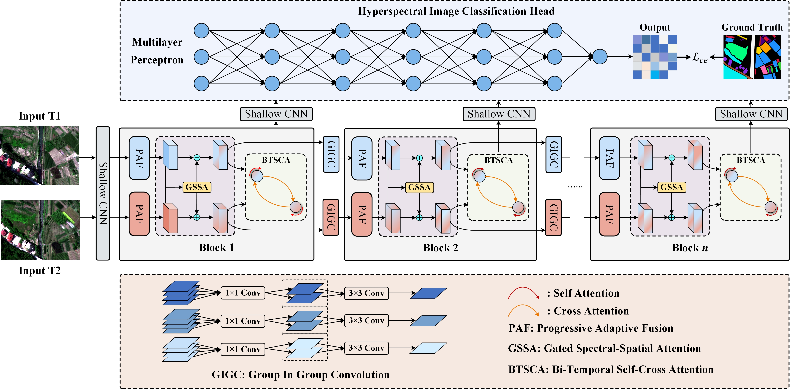

<h2 align="center">[TIP 2026] Bi-Temporal Benefits: Progressive Spectral-Spatial-Temporal Feature Extraction for Hyperspectral Image Classification</h2>

<p align="center">
  <strong>Official PyTorch Implementation of BehalfNet</strong>
</p>

<p align="center">
  <a href="https://ieeexplore.ieee.org/document/11536832">📄 Paper</a> |
  <a href="https://pan.baidu.com/s/1zgo9RkQlSydAc6YL85v98A?pwd=WTTE">📊 Dataset</a>
</p>

<p align="center">
  <strong>Wenming Liu</strong><sup>1</sup>,
  <strong>Shuang Li</strong><sup>1</sup>,
  <strong>Xinghua Li</strong><sup>1,*</sup>
</p>

<p align="center">
  <sup>1</sup> School of Remote Sensing and Information Engineering, Wuhan University, Wuhan, China <br>
</p>

---

## 🧠 Network Architecture

<p align="center">
  
</p>

<p align="center">
  <em>Fig.1 Overall architecture of the proposed BehalfNet.</em>
</p>

---

## 📊 Dataset


### 1) Dataset Download

The Anji and Viareggio datasets used in this paper can be downloaded from:

- **Baidu Netdisk:** [Download](https://pan.baidu.com/s/1zgo9RkQlSydAc6YL85v98A?pwd=WTTE)

### 2) Dataset Information

| Dataset | Spatial Size | Bands T1 / T2 | Wavelength | Spatial Resolution | Sensor | T1 Date | T2 Date |
|:---:|:---:|:---:|:---:|:---:|:---:|:---:|:---:|
| Anji | 1546 × 2068 | 126 / 124 | 350–1000 nm | 0.1 m | CMOS | 2024/04/10 | 2024/06/12 |
| Viareggio | 375 × 450 | 127 / 127 | 400–1000 nm | 0.6 m | SIM.GA | 2013/05/08 | 2013/05/09 |

### 3) Dataset Organization

Please organize the datasets as follows:

```text
BehalfNet/
├── dataset/
│   ├── Anji/
│   │   ├── Time1.tif
│   │   ├── Time2.tif
│   │   └── label.tif
│   │
│   └── Viareggio/
│       ├── Time1.tif
│       ├── Time2.tif
│       └── label.tif
```

---

## ⚙️ Installation

Create a conda environment:

```bash
conda create -n behalfnet python=3.9
conda activate behalfnet
```

Install dependencies:

```bash
pip install -r requirements.txt
```

---

## ⭐ Train and Test

### 1）Training

```bash
python main.py \
  --model behalfnet \
  --dataset_name Bi-Temporal-split \
  --dataset_dir ./dataset/Anji \
  --device 0 \
  --patch_size 24 \
  --num_run 1 \
  --epoch 400 \
  --bs 32 \
  --ratio 0.002
```

### 2) Testing

```bash
python eval.py \
  --model behalfnet \
  --dataset_name Bi-Temporal-split \
  --dataset_dir ./dataset/Anji \
  --device 0 \
  --patch_size 24 \
  --weights ./checkpoints/behalfnet/Anji/Bi-Temporal-split/0 \
  --outputs ./results
```

## 👁️ Visual Results

### Anji Dataset of Bi-Temporal Scene

<p align="center">
  
</p>

<p align="center">
  <em>Fig.2 Classification maps on the Anji dataset under the bi-temporal setting.</em>
</p>

### Viareggio Dataset of Bi-Temporal Scene

<p align="center">
  
</p>

<p align="center">
  <em>Fig.3 Classification maps on the Viareggio dataset under the bi-temporal setting.</em>
</p>

---

## 🔍 Bi-Temporal Benefit Visualization on Anji Dataset

<p align="center">
  
</p>

<p align="center">
  <em>Fig.4 Qualitative comparison of pixel-level classification changes for each method with bi-temporal data.</em>
</p>

<p align="center">
  
</p>

<p align="center">
  <em>Fig.5 Per-class quantitative accuracy analysis of all methods on the 12 land-cover categories.</em>
</p>

---

## 📖 Citation

If you find this work useful, please consider citing our paper:

```bibtex
@article{behalfnet,
  title   = {Bi-Temporal Benefits: Progressive Spectral-Spatial-Temporal Feature Extraction for Hyperspectral Image Classification},
  author  = {Liu, Wenming and Li, Shuang and Li, Xinghua},
  journal = {IEEE Transactions on Image Processing},
  year    = {2026},
  volume  = {35},
  number  = {},
  pages   = {},
  doi     = {10.1109/TIP.2026.3695412}
}
```


If you use the Viareggio dataset, please also cite the original dataset paper:

```bibtex
@article{viareggio,
  title   = {Hyperspectral Airborne ``Viareggio 2013 Trial'' Data Collection for Detection Algorithm Assessment},
  author  = {Acito, Nicola and Matteoli, Stefania and Rossi, Andrea and Diani, Marco and Corsini, Giovanni},
  journal = {IEEE Journal of Selected Topics in Applied Earth Observations and Remote Sensing},
  volume  = {9},
  pages   = {2365--2376},
  year    = {2016},
  doi     = {10.1109/JSTARS.2016.2531747}
}
```

---

## 🙏 Acknowledgements

This work was supported in part by the National Natural Science Foundation of China under Grant **42571368**.

We sincerely thank the authors of the public datasets and open-source projects that support this work.

Parts of this repository may be inspired by or adapted from the following projects:

- [GSC-ViT](https://github.com/flyzzie/TGRS-GSC-VIT)
- [DCN-T](https://github.com/DotWang/DCN-T)
- [LatticeNet](https://github.com/VipSuperLab/LatticeNet)

---

## 📄 License

The code and Anji dataset is released for academic research purposes only.

For the Viareggio dataset, please follow the license and usage policy of the original dataset provider.

---

## 📬 Contact

For questions about the paper, code, or dataset, please contact:

- **Wenming Liu** — [wenmingliu@whu.edu.cn](mailto:wenmingliu@whu.edu.cn)
- **Shuang Li** — [sli@whu.edu.cn](mailto:sli@whu.edu.cn)
- **Xinghua Li** — [lixinghua5540@whu.edu.cn](mailto:lixinghua5540@whu.edu.cn)

---

## ⭐ Star

If this repository is helpful to your research, please consider giving it a star.